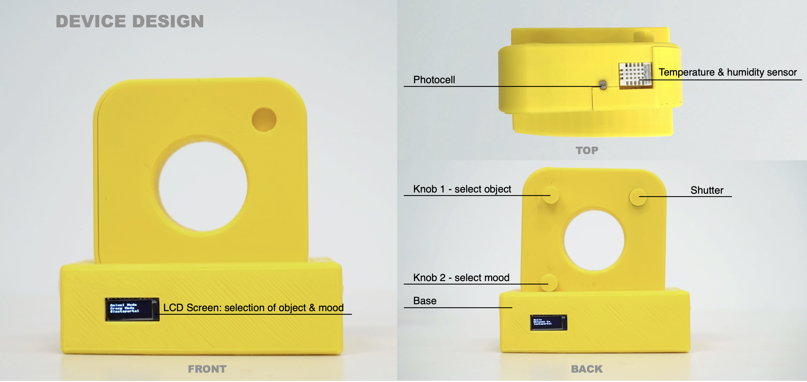

# Instaportal

Instaportal is an installation that allows users to post great Instagrams with the parameters from their own choices and the surrounding environment. It can detect the humidity, temperature, and illumination to generate an image from a similar condition, pretending that users are there.

## Miniature
**Camera**
 - 10-position BCD rotary switch
 - mini-tactile pushbutton switch
 - CdS photoresistor
 - DHT22 temperature-humidity sensor
 - ESP32 feather board  

**Base**
 - FeatherWing OLED
 - ESP32 feather board
 
## Notification

Be careful if you want to use 10-position BCD rotary switch. It has four pins, each of which emits high and low electric current. The digital value, such as 1 and 0, can't be read directly. The switch occupies four pins of the feather board while needing the customized code for your expected values of 10 positions.

## Installation
 

 

More introductions about this project can be checked out [here](https://vimeo.com/manage/videos/730514325).
